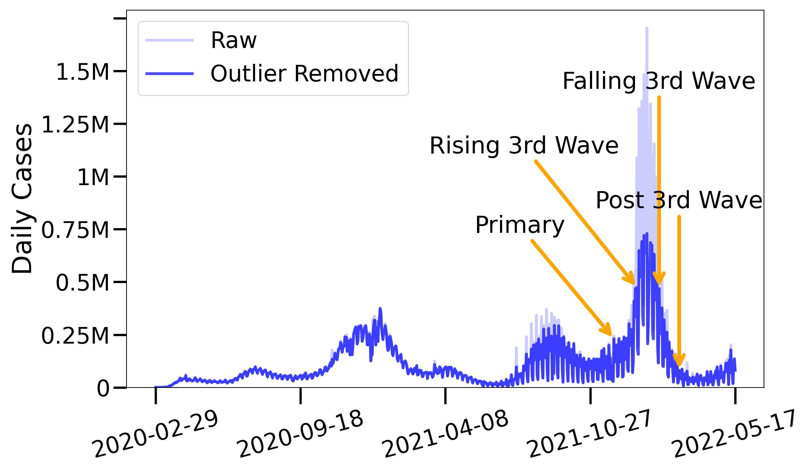
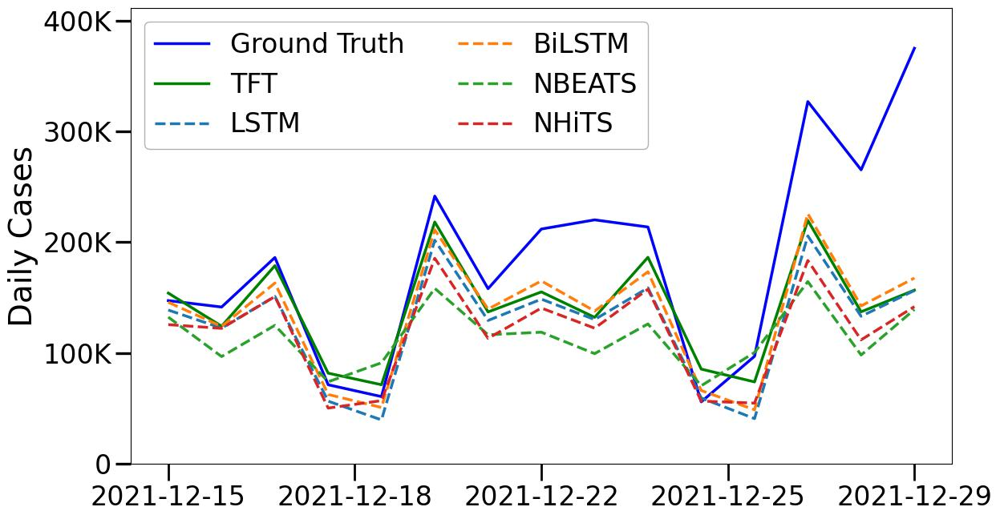
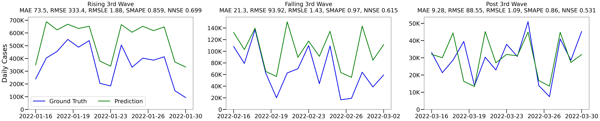

# Results
Results on all 3,142 US counties are listed bellow.

## Ground Truth

## Benchmark

Test result comparison of TFT with five other deep learning models.

## Temporal Patterns

Time series data typically exhibit various temporal patterns,
such as trend, seasonal, and cyclic patterns. Here we investigate how well our TFT model can learn and interpret these patterns by conducting
experiments on data with these patterns.

1. Attention weights aggregated by past time index showing high importance in the `same day the previous week` (position index -7). 
2. Weekly `seasonality` due to reporting calculated using auto-correlation at different lag days $k \in [1, 21]$. Our analysis shows a clear weekly periodicity, where the correlation peaks at lag day k = 7.  This is attributed to weekly reporting style from hospitals, leading to less reported cases on weekends.

3. `Cyclic` holiday patterns (Thanksgiving, Christmas). During holidays, hospitals and COVID-19 test centers often have reduced staffing and operating hours, leading to fewer tests and reported case. Leading to a drop in attention for those days. 
4. `Trend`: TFT model's test performance on all US counties for additional data splits learning different infection trends 

## Spatial Patterns

Spatial distribution of COVID-19 cases in US counties and corresponding attention weights from TFT.

1.  Cumulative COVID-19 cases across US counties 

2. Avg. attention weights across US counties from TFT 

